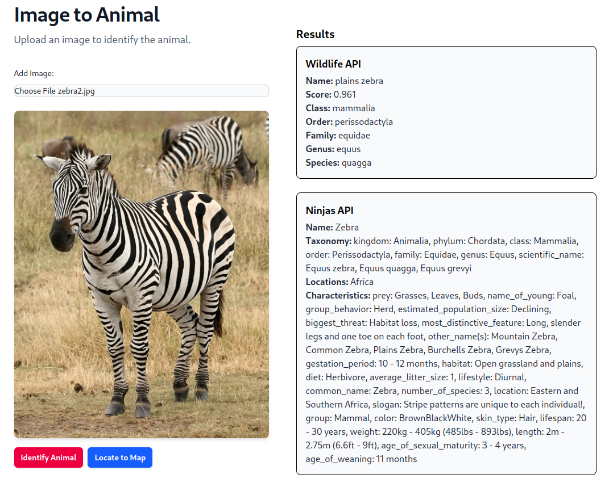
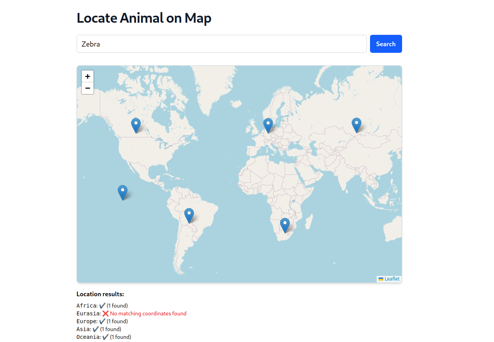
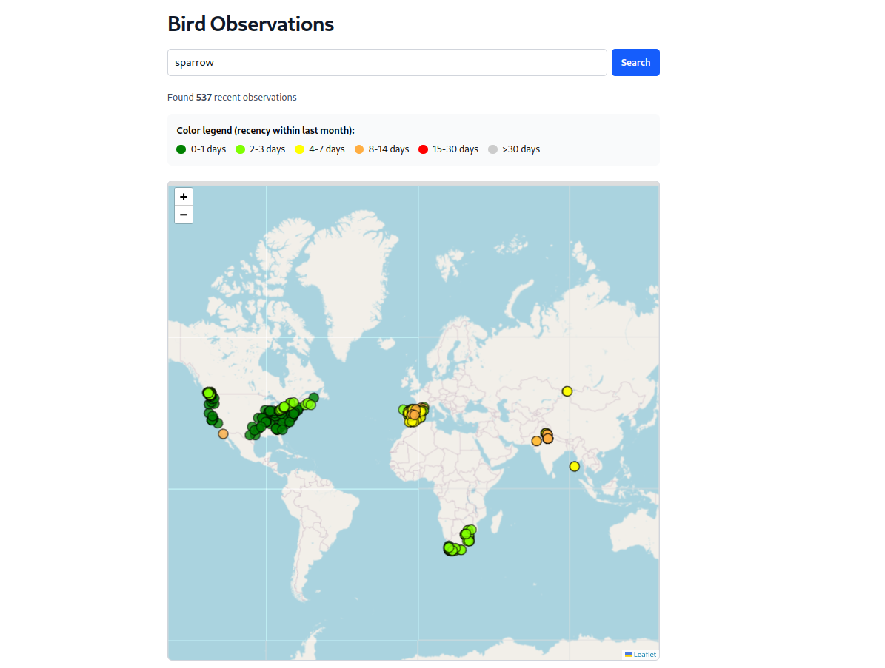
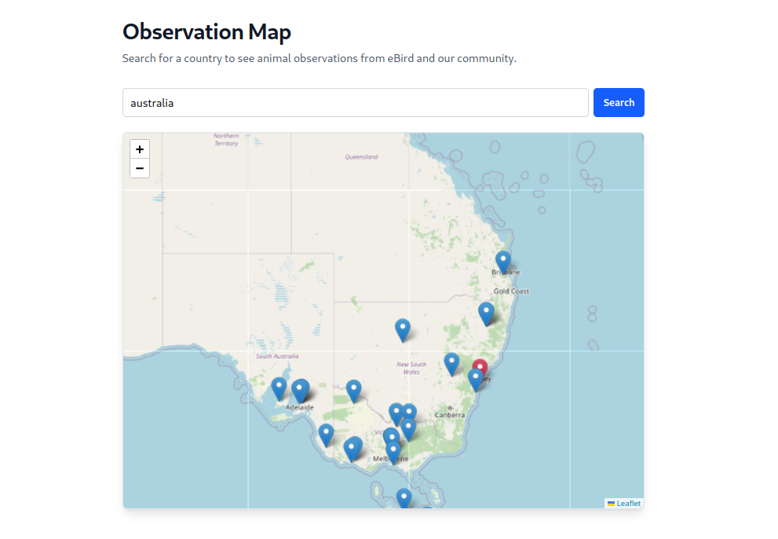
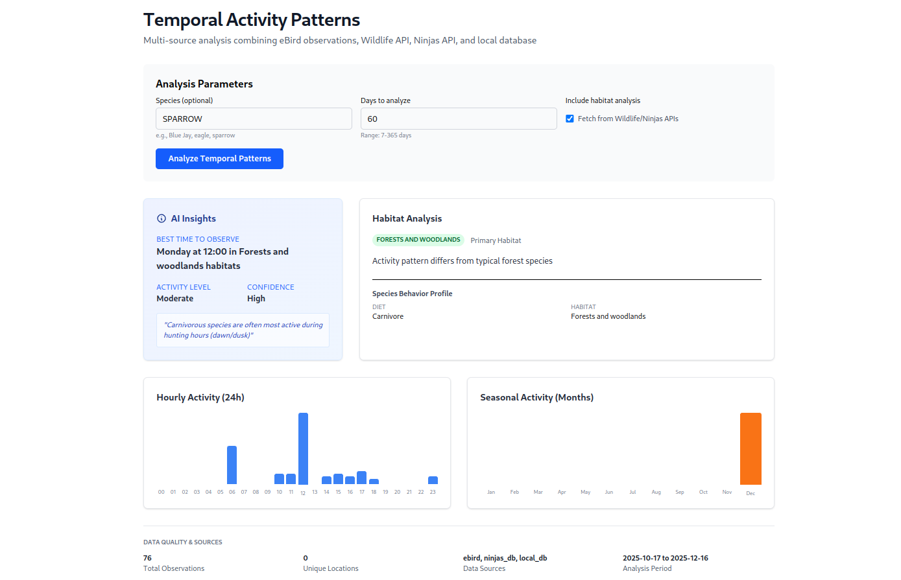

# Animal to Map

by Anna Marín and May Castells

## Project description:

In this project, we created a simple web service that uses four APIs (ebirb,open street map,Ninjas API, and Animal Detect) to get information about animals and maps. The web service backend is built with FastAPI and the frontend with React. We started with a GitHub simple template for FastAPI and React applications that the teacher showed us in class and then we added the required features and modified some behaviors to fit our needs.

## Installation and deployment

Create the apps containers with docker

```
docker-compose build --no-cache
```

and start them:

```
docker-compose up --build
```

## How to use

First of all, make sure to put the different API keys into the `.env` file

Then start the application with docker and go to the app page (http://localhost:3000 by default).

## Api call examples

### POST /api/v1/image-upload/image-to-animal-info



### GET api_v1/endpoints/maps/animal-to-map



### GET api_v1/endpoints/maps/ebird-observations-map



### GET api_v1/endpoints/observations/search



### GET /api_v1/endpoints/analytics/temporal-patterns


